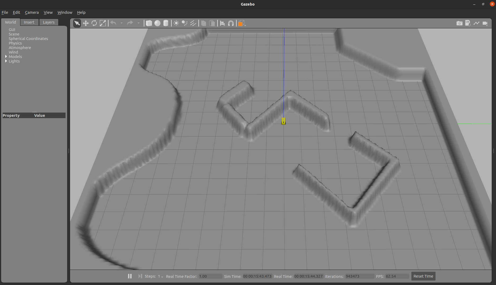
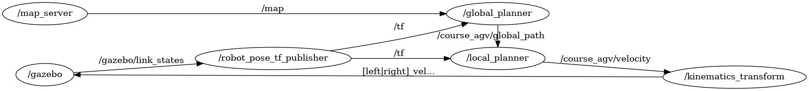

# 2022暑期 机器人与系统综合实践 

## 移动机器人部分

实验目的：

* 完成路径规划算法
* 完成速度规划算法对路径进行跟随

实验步骤：

* 安装ROS环境及相关依赖包，运行相关launch文件进行环境验证
* （中期检查）完成RRT算法编写并在RVIZ上显示
* 完成运动学分解
* 完成DWA算法编写完成移动机器人的路径跟踪

具体流程：

* 安装ROS并学习如何使用，[官网链接](http://wiki.ros.org/cn/ROS/Tutorials)
* 测试环境是否运行成功`roslaunch course_agv_gazebo course_agv_world.launch`
* 阅读global_planner相关代码并完成rrt.py实现相应功能
* 阅读kinematics补全运动学分解
* 阅读local_planner相关代码并完成dwa.py实现相应功能



文件结构

```bash
sudo apt install ros-`rosversion -d`-joint-state-publisher-gui ros-`rosversion -d`-joint-state-controller ros-`rosversion -d`-controller-manager ros-`rosversion -d`-gazebo-ros-pkgs ros-`rosversion -d`-gazebo-ros-control ros-`rosversion -d`-velocity-controllers ros-`rosversion -d`-map-server
sudo apt install xterm
```


```bash
src
├── course_agv_control
│   ├── CMakeLists.txt
│   ├── config
│   │   └── course_agv_control.yaml
│   ├── launch
│   │   └── course_agv_control.launch
│   ├── package.xml
│   └── scripts
│       └── kinematics.py # 运动学分解，TODO
├── course_agv_description
│   ├── CMakeLists.txt
│   ├── launch
│   │   ├── course_agv.rviz
│   │   └── course_agv_rviz.launch
│   ├── package.xml
│   └── urdf
│       ├── course_agv.gazebo
│       ├── course_agv.xacro # gazebo中机器人定义
│       └── materials.xacro
├── course_agv_gazebo
│   ├── CMakeLists.txt
│   ├── config
│   │   ├── map # 地图文件
│   │   │   └── map.png
│   │   └── map.yaml
│   ├── launch
│   │   ├── course_agv.rviz
│   │   ├── course_agv_world.launch
│   │   └── course_agv_world_rviz.launch
│   ├── models
│   │   └── ground_plane_for_agv
│   │       ├── map # 用于gazebo的地图文件
│   │       │   └── map.png
│   │       ├── model.config
│   │       └── model.sdf
│   ├── package.xml
│   ├── scripts
│   │   └── robot_tf.py # 机器人TF发送
│   └── worlds
│       └── course_agv.world
└── course_agv_nav
    ├── CMakeLists.txt
    ├── config
    ├── launch
    │   ├── nav.launch
    │   └── nav.rviz
    ├── msg
    ├── package.xml
    ├── scripts
    │   ├── dwa.py # DWA算法实现，TODO
    │   ├── global_planner.py
    │   ├── local_planner.py
    │   └── rrt.py # RRT算法实现，TODO(文件待创建)
    └── srv
        └── Plan.srv

```

